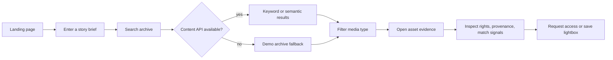
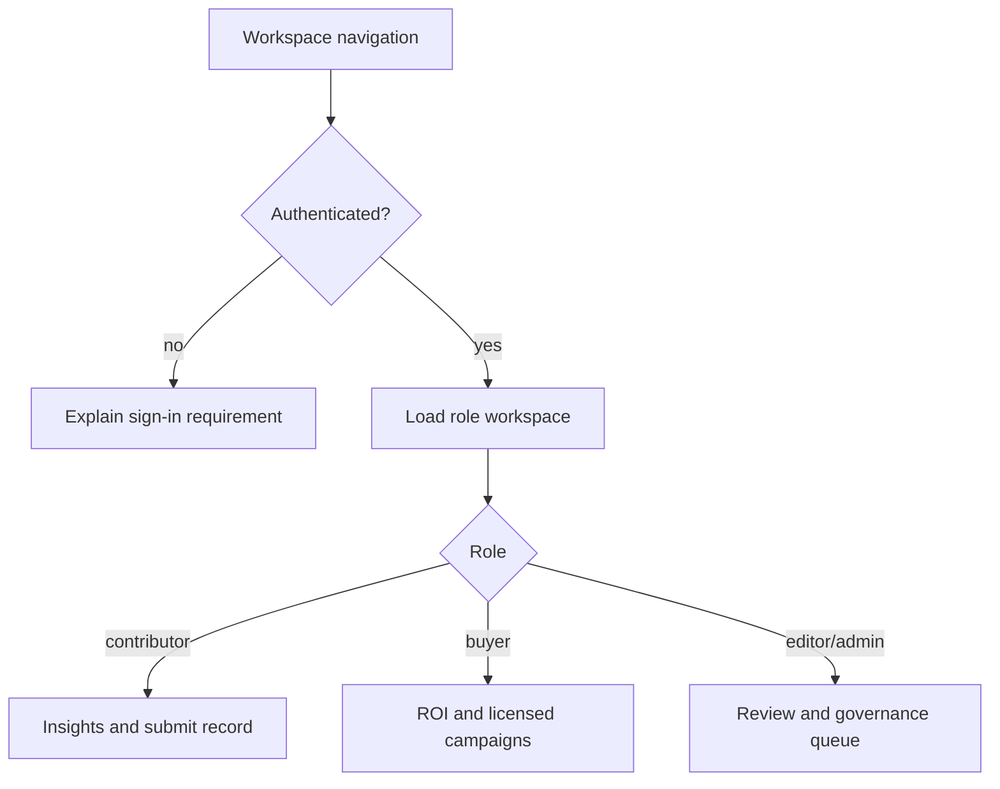
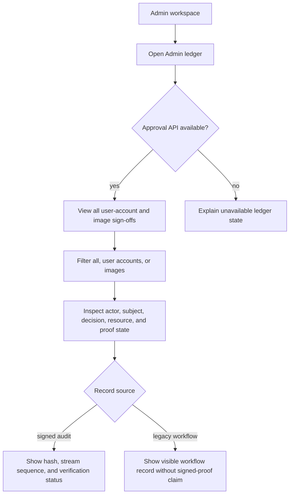
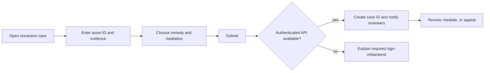

# Veld Archive UX process flows

These flows define the minimum product journeys covered by browser QA. The solid path must work in the live read-only demo; authenticated write steps require the Worker and D1 resources.

## Explore and search



Video previews show a distinct `VELD ARCHIVE · PREVIEW / NOT LICENSED FOR USE`
watermark. The Worker never falls back to an original video for an anonymous or
unpaid viewer; once a paid entitlement is confirmed, the authenticated viewer
can play the original through the preview route and download it from the
licensed workspace.

## Identity and workspaces



## Buyer licence validation

1. A signed-in buyer opens the Buyer ROI workspace and selects a published asset.
2. The buyer chooses a licence type, territory, and duration, then runs the
   server-side validation check.
3. The Worker returns approval, rights-scope, model-release, and property-release
   checks plus the current price. The UI shows every check before any request
   is created.
4. If a check fails, the buyer can change the intended use or open the
   resolution desk. If all checks pass, creating a licence request records a
   pending request but does not charge payment.

The unavailable-backend state explains that no licence or payment was created
and offers a retry. A missing published-asset state sends the buyer back to
approved archive search.

## Contributor to publication

```mermaid
sequenceDiagram
  participant C as Contributor
  participant UI as Veld UI
  participant API as Worker API
  participant DB as D1
  C->>UI: Complete profile and seller tender
  UI->>API: Submit authenticated forms with CSRF token
  API->>DB: Create tender and asset record
  API-->>UI: Pending review confirmation
  C->>UI: Submit metadata and media
  UI->>API: Create asset / upload session
  API->>DB: Scan upload and advance media revision
  API-->>UI: AI enrichment queued once for this new image revision
  API->>DB: Store description, visible setting, category, attributes and visible text as suggestions
  C->>UI: Review/correct suggestions and evidence-backed location
  UI->>API: Save reviewed metadata revision
  Note over C,API: Later corrections never invoke AI again; retries reuse the original upload job
  C->>UI: Approve reviewed revision
  API->>DB: Add approved revision to FTS5 and queue Vectorize upsert
  API-->>UI: Published; index current or pending
  C->>UI: Check contributor insights
```

## Top-admin approval ledger



## Rights case



## QA acceptance criteria

- Every navigation control changes view or gives a clear prerequisite message.
- Search submits on Enter and button click; suggestion chips never submit the form accidentally.
- Search results remain useful when the read-only API is unavailable.
- Asset cards open a detail/evidence modal and the modal closes by close button, backdrop, and Escape.
- Protected workflows explain sign-in and backend requirements rather than silently failing.
- Form validation prevents incomplete submissions and successful actions show confirmation state.
- AI may classify a visible setting such as `market_scene`; only seller, EXIF, or editor evidence may populate geographic location fields.
- Approval is unavailable until the current metadata revision is explicitly reviewed, and buyer search ignores stale revisions.
- The top-admin ledger lists user-account and image approval/sign-off events with actor, subject, decision, resource, source, and integrity state.
