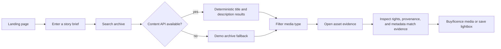
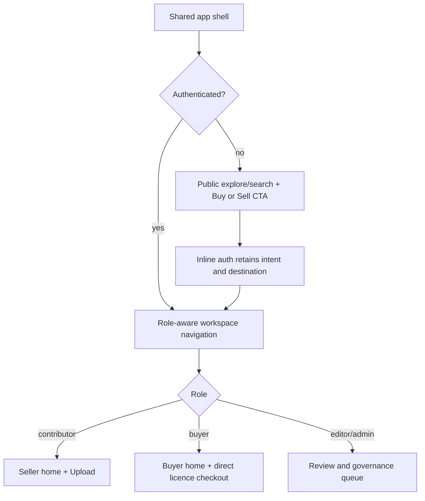
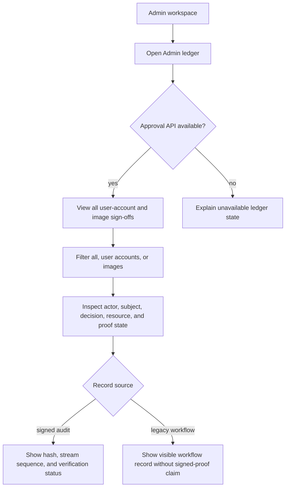
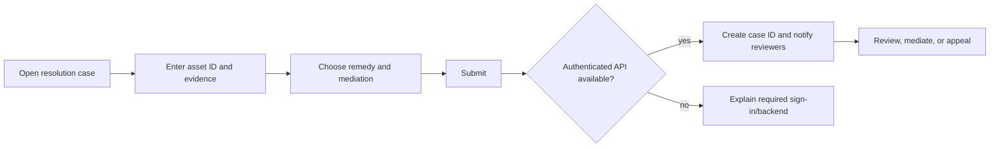
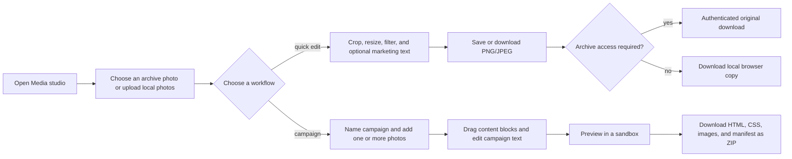

# Stockvel UX process flows

These flows define the minimum product journeys covered by browser QA. The solid path must work in the live read-only demo; authenticated write steps require the Worker and D1 resources.

## App shell and role handoff

The native Expo client on `better-2` and the Cloudflare web client on `main`
share actor intent and Worker contracts but use platform-appropriate shells.
Anonymous users can explore approved media, then choose **Create buyer account**
or **Sell your media**. Protected actions open authentication in context, retain
the selected asset or upload destination, and resume after the verified session
exchange.

The web sidebar is role-aware: buyers see Buyer home and Media studio, sellers
see Seller home with **+ Upload media**, and editors/admins see authorized review
and governance surfaces. Expo maps the same intent to native tabs: buyers get
Buyer, sellers get Upload with a central plus action, and editors/admins get a
review-capable upload entry point. Neither client presents a role-gated
destination as a dead-end page.

## Explore and search



Video previews show a distinct `STOCKVEL · PREVIEW / NOT LICENSED FOR USE`
watermark. The Worker never falls back to an original video for an anonymous or
unpaid viewer; once a paid entitlement is confirmed, the authenticated viewer
can play the original through the preview route and download it from the
licensed workspace.

## Identity and workspaces



### Password recovery

1. A visitor opens the email sign-in form and chooses **Forgot password?**.
2. The app sends the email address to Supabase and always shows the same
   confirmation whether an account exists. The app does not store reset tokens
   or passwords.
3. The visitor follows the single-use link back to the web origin or the native
   `stockvel://auth/recovery` route. The app shows only the new-password form
   while Supabase holds the verified recovery session.
4. After the password is updated, the recovery session is signed out and the
   visitor is returned to sign-in. Expired or unavailable links show the provider
   error and offer a path to request another link.

### South African phone OTP

1. A visitor chooses **SMS** and enters a South African mobile number in the
   familiar local format, for example `073 712 3456`. The form explains that
   `+27` is added automatically; users do not need to type it.
2. The client validates the number, converts it to canonical `+27…` E.164,
   and asks Supabase for a six-digit SMS code. Invalid country codes,
   landlines, and malformed numbers are rejected before an SMS request.
3. If Supabase has no SMS provider configured, the form explains that an
   administrator must enable Phone authentication and an SMS provider in the
   Supabase project. The entered number remains available for correction and
   retry.
4. After verification, the Worker accepts only a South African phone claim
   and exchanges the verified Supabase identity for the normal Stockvel session.

## Buyer licence validation

1. An authenticated buyer, or a seller/editor acting as a buyer, opens any
   published asset from Explore, Search, or the Buyer ROI workspace.
2. The first purchase card shows the access decision in plain language:
   **Included with your active Stockvel membership — no credits required**, or
   **Buy this asset with X credits**. Credits unlock downloads/streams and the
   validity starts at purchase. When the seller includes the asset in
   membership, the buyer sees the alternative **Included with an active Stockvel
   membership** path.
3. The Worker checks whether the seller included the asset in the Stockvel monthly
   membership. An active membership grants included assets without spending
   credits. Buyers without an active membership use the seller-listed credit
   amount for that asset; an active membership does not make a seller-excluded
   asset free.
4. The buyer chooses a licence type, territory, and duration only after the
   credit access card is visible, then runs the server-side validation check.
   The UI shows approval, rights-scope, model-release, and property-release
   checks before a request is created.

5. The account purchase history shows pending contracts with a clear “Continue
   to payment” action. Retrying the same purchase reuses the existing pending
   contract rather than creating a duplicate. If the payment provider is
   unavailable, the pending contract remains visible and the UI explains that
   no charge was made.

6. If the buyer has insufficient credits, the screen shows the available and
   required balance and one **Buy X credits** action. No licence is created
   until the credit wallet is funded and the buyer retries.

7. If checks pass, the buyer reads and explicitly accepts the versioned Buyer
   Licence and Payment Terms. Membership-included access is recorded without a
   credit charge; non-member access atomically spends the seller-listed
   credits and records a paid licence. Retrying remains idempotent.

8. The buyer may enable Auto-approval for their own new requests by checking
   the sign-off acknowledgement and saving it. Auto-approval applies only
   after the same server-side rights and release checks pass; it does not
   bypass pricing, payment, or original-file access. The setting is auditable
   and can be revoked at any time.

9. Custom buying remains available in the seller/admin listing section, but it
   is hidden from the buyer path until the buyer enables **Include custom
   buying** in the Search bar. An opted-in custom listing shows its seller-
   listed credit amount and uses the same rights checks and credit checkout;
   the buyer is not shown a set of Rand offers or negotiation controls.

10. The buyer sees a purchase description for the selected licence type, the
    territory and duration being checked, the credit amount, and the fact that
    original access follows the recorded entitlement. The CEO/admin ledger
    shows the buyer sign-off, terms version, revocation, auto-approved requests,
    and paid versus unpaid status for the organisation.

The unavailable-backend state explains whether a pending licence was already
created, confirms that no charge was made, and offers a retry. A missing
published-asset state sends the buyer back to approved archive search.

## Buyer campaign-pack approval

1. A signed-in buyer opens a campaign workspace and sees the current buyer
   licence and payment terms directly above the ranked source photos.
2. The buyer must open the terms, then explicitly accept the displayed
   versions. The acceptance is recorded against that campaign and buyer.
3. Until that acceptance succeeds, **Approve for pack** remains disabled and
   the Worker rejects direct approval requests as well.
4. Rights warnings and provenance remain visible on each source before the
   buyer approves it. A failed acceptance or unavailable backend leaves the
   source unapproved and offers a retry.

## Buyer purchase history, membership, and credits

1. A signed-in buyer opens the Buyer ROI workspace and sees the complete
   purchase history, including licences, photographer subscriptions, monthly
   membership payments, and credit purchases.
2. The buyer chooses a configured monthly or annual Paystack plan, then opens
   hosted payment checkout. The browser success redirect is not proof of payment.
3. The membership remains pending until the signed payment webhook confirms
   payment. A confirmed payment activates the membership and records the next
   charge date; a failed payment shows an attention state.
4. The buyer sees the standard credit product first: **100 credits — 12 months
   access**. The buyer can purchase credits through hosted checkout; credits
   are added to the buyer ledger only after the signed payment webhook confirms
   payment. Any Rand amount is a single optional display-only reference, never
   the buyer-facing product price.
5. The buyer can cancel a pending or active membership. Credit balances and
   transaction history remain visible for seller-listed media access and
   opt-in custom buying.

The unavailable-backend state does not show cached money or credit balances and
offers a retry. Checkout routes fail closed when the payment provider is not
configured, and payment success is never inferred from the browser redirect.
The explicitly marked demo environment uses a server-side simulated provider
for credit and licence walkthroughs only; production credit purchases still
require a signed provider webhook before credits are added to the wallet.

## Signup, introductory photos, and access choice

1. A visitor opens **Create an account** from an artist-approved free photo or
   the Subscribe CTA. Email confirmation (or South African phone OTP) is
   required before any allowance can be claimed. If the confirmation email is
   missing, the sign-in state keeps the address and offers **Resend confirmation
   email**; provider rate limits and delivery failures show a recovery action.
2. After sign-in, the account surface shows a server-authoritative allowance
   of three free photo downloads. The Worker atomically claims one published
   artist-approved photo per buyer and asset; retries do not spend another
   download, and the limit cannot be bypassed by browser storage or a client
   counter.
3. When the allowance is exhausted, the buyer sees the evidence and next
   action: buy a once-off download bundle or choose unlimited monthly/annual
   access. Paystack webhook confirmation remains the source of truth for paid
   entitlements.
4. During upload, an artist can opt an image into the introductory offer.
   Video, unpublished, rights-pending, or withdrawn records are never eligible;
   editorial approval remains the publication gate.

## Contributor to publication

The native Expo route begins with seller account creation by email confirmation or phone OTP. Email confirmation returns through `stockvel://auth/confirmed`; the verified email or phone identity is exchanged for a short-lived Stockvel API session and a new seller account is provisioned as a contributor. Existing memberships are never upgraded from a client-provided seller intent. Phone-only accounts use the verified phone as the identity and must collect a real contact email before workflows that require email delivery.

```mermaid
sequenceDiagram
  participant C as Contributor
  participant UI as Stockvel UI
  participant API as Worker API
  participant DB as D1
  C->>UI: Complete profile and seller tender
  UI->>API: Submit authenticated forms with CSRF token
  API->>DB: Create tender and asset record
  API-->>UI: Pending review confirmation
  C->>UI: Submit metadata and media
  UI->>API: Create asset / upload session
  API->>DB: Scan upload and advance media revision
  API-->>UI: AI enrichment queued once for this new image revision
  API->>DB: Store description, visible setting, category, attributes and visible text as suggestions
  C->>UI: Review/correct suggestions and evidence-backed location
  UI->>API: Save reviewed metadata revision
  Note over C,API: Later corrections never invoke AI again; retries reuse the original upload job
  C->>UI: Approve reviewed revision
  API->>DB: Add approved revision to the title/description FTS5 search index
  API->>DB: Keep any background vector job separate from live buyer search
  API-->>UI: Published; index current or pending
  C->>UI: Check contributor insights
```

On mobile, the seller tender is split into three recoverable steps: contributor profile, individual/company identity verification, then signed contract and payout setup. Company verification uses CIPC before the hosted Didit session. Contract submission uses a transient Turnstile token and Firma reference; payout stores only the provider account reference and optional last-four values. When any provider is unavailable, the completed data remains stored, the failed step explains what happened, and the user can retry without creating a duplicate identity or contract implicitly.

On the web seller flow, the profile and seller setup each use the same current-agreement review widget. The seller opens the full versioned agreement, checks an explicit acknowledgement inside the widget, and only then can the acceptance be submitted. Escape, the visible close control, and the backdrop close the widget; focus returns to the review button. The Worker rejects stale or missing agreement versions and records accepted profile terms with their hash.

When a seller submits media, the upload form asks plain-language questions about
permission to list/licence the work, recognizable people, and private property or
locations. “Model release” means written permission from a recognizable person
for uses such as commercial or advertising use; it is not a seller-verification
button. “Pending” means the evidence still needs Stockvel review. Sellers can report
editorial-only or unresolved permissions, but only an editor/admin can mark
rights or release evidence as verified. The same explanations remain available
when a seller edits an existing record.

## Top-admin approval ledger



## Rights case



## Buyer media studio: quick photo edit and campaign handoff



The campaign selection is intentionally not capped at four photos. Empty,
preview-unavailable, and access-blocked states remain explicit. Archive
originals use the authenticated original route; local uploads use temporary
browser object URLs and are never written to the archive. The campaign preview
is rendered in a sandbox and the export boundary strips scripts and unsafe
event attributes before creating the ZIP.

## QA acceptance criteria

- Every navigation control changes view or gives a clear prerequisite message.
- Search submits on Enter and button click; suggestion chips never submit the form accidentally.
- Search results remain useful when the read-only API is unavailable.
- Live search uses approved title and description metadata only; exact title,
  contains, and bounded typo-tolerant fuzzy matches remain deterministic, and
  no semantic or image-AI result is mixed into the buyer result set.
- A no-result response explains the empty state and may offer alternatives
  derived from stored metadata; each alternative is an explicit, non-submitting
  action.
- Asset cards open a detail/evidence modal and the modal closes by close button, backdrop, and Escape.
- Buyer checkout stays in the asset evidence flow: validation, versioned terms, hosted payment, pending retry, and webhook-confirmed delivery are all explicit.
- Seller surfaces expose one primary upload action, preserve media/metadata on recoverable errors, and report that approval is required before search visibility.
- Protected workflows explain sign-in and backend requirements rather than silently failing.
- Form validation prevents incomplete submissions and successful actions show confirmation state.
- AI may classify a visible setting such as `market_scene`; only seller, EXIF, or editor evidence may populate geographic location fields. Those pixel-derived fields are not used to rank live buyer search.
- Approval is unavailable until the current metadata revision is explicitly reviewed, and buyer search ignores stale revisions.
- The top-admin ledger lists user-account and image approval/sign-off events with actor, subject, decision, resource, source, and integrity state.
